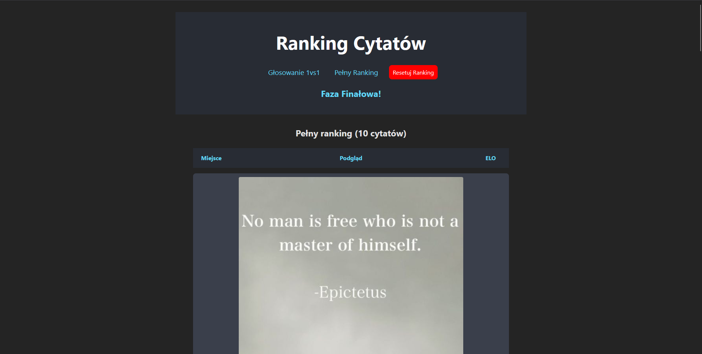
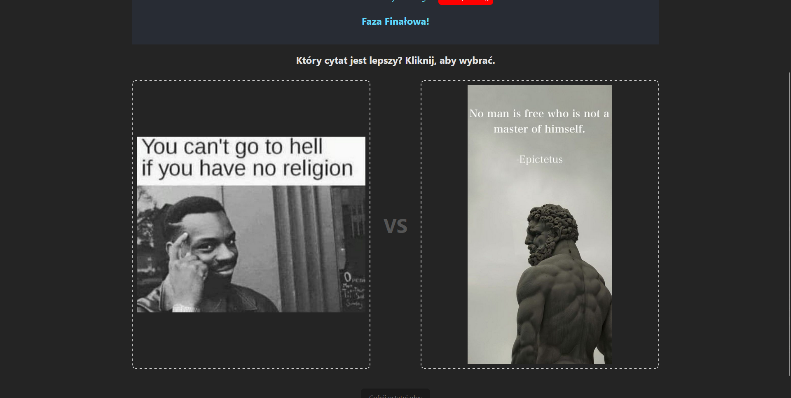

# Ranking Cytatów

Prosta, ale potężna aplikacja internetowa do tworzenia subiektywnego rankingu obrazków (np. cytatów w formie graficznej) przy użyciu systemu rankingowego Elo. Projekt został stworzony, aby pomóc w uszeregowaniu dużej liczby elementów od najlepszego do najgorszego poprzez serię porównań "jeden na jeden".

Aplikacja jest zbudowana w React i TypeScript, a jej celem jest zapewnienie płynnego, interaktywnego i satysfakcjonującego doświadczenia użytkownika.


_Główny Ranking_

_Strona Głosowania_

## Główne Funkcje

- **System Rankingowy Elo:** Każdy obrazek posiada ranking Elo, który zmienia się dynamicznie po każdym porównaniu, zapewniając sprawiedliwy i precyzyjny system oceny.
- **System Frazowy:** Aby poradzić sobie z dużą liczbą obrazków, ranking podzielony jest na dwie fazy:
  1.  **Faza Eliminacji:** Szeroka faza, w której inteligentny algorytm zapewnia, że każdy obrazek jest oceniany przynajmniej kilka razy, ze szczególnym uwzględnieniem tych najrzadziej widzianych.
  2.  **Faza Finałowa:** Po zakończeniu eliminacji, najlepsze 32 obrazki przechodzą do rundy finałowej, gdzie pojedynki stają się bardziej zacięte, co pozwala na precyzyjne wyłonienie Top 10.
- **Interaktywne Głosowanie 1vs1:** Prosty i przejrzysty interfejs do porównywania dwóch obrazków obok siebie.
- **Płynne Animacje:** Głosowanie jest wzbogacone o satysfakcjonujące animacje wejścia, wyboru (zielona/czerwona poświata) oraz "rzucania" przegranego obrazka poza ekran.
- **Dynamiczny Widok Rankingu:** Przejrzysta, sortowana lista wszystkich obrazków z ich aktualnym rankingiem Elo, miejscem i liczbą rozegranych pojedynków.
- **Funkcja "Cofnij":** Możliwość cofnięcia ostatniego głosu w przypadku pomyłki. System przywraca zarówno rankingi, jak i poprzednią parę do oceny.
- **Zapis Postępów:** Cały postęp rankingu jest automatycznie zapisywany w `localStorage` przeglądarki, co pozwala na kontynuowanie oceniania w dowolnym momencie.

## Stos Technologiczny

- **Framework:** [React](https://react.dev/)
- **Bundler:** [Vite](https://vitejs.dev/)
- **Język:** [TypeScript](https://www.typescriptlang.org/)
- **Routing:** [React Router](https://reactrouter.com/)
- **Styling:** Czysty CSS z wykorzystaniem Flexbox i CSS Grid.

## Uruchomienie Projektu

Aby uruchomić projekt lokalnie na swoim komputerze, wykonaj poniższe kroki.

1.  **Sklonuj repozytorium:**

    ```bash
    git clone https://github.com/twoja-nazwa-uzytkownika/ranking-cytatow.git
    ```

2.  **Przejdź do folderu projektu:**

    ```bash
    cd ranking-cytatow
    ```

3.  **Zainstaluj zależności:**

    ```bash
    npm install
    ```

4.  **Uruchom serwer deweloperski:**

    ```bash
    npm run dev
    ```

5.  Otwórz przeglądarkę i przejdź pod adres `http://localhost:5173` (lub inny, który pojawi się w Twojej konsoli).

## Struktura Projektu

Najważniejsze pliki i foldery w projekcie:

```
/src
├── /components     # Małe, reużywalne komponenty (ImageCard, UndoButton itp.)
├── /utils          # Funkcje pomocnicze (np. kalkulator Elo)
├── /types          # Definicje typów i interfejsów TypeScript
├── App.tsx         # Główny komponent, serce aplikacji, zarządza stanem
├── Ranking.tsx     # Komponent strony z widokiem rankingu
└── Tournament.tsx  # Komponent strony z pojedynkami 1vs1
```

## Licencja

Projekt jest udostępniony na licencji MIT.
